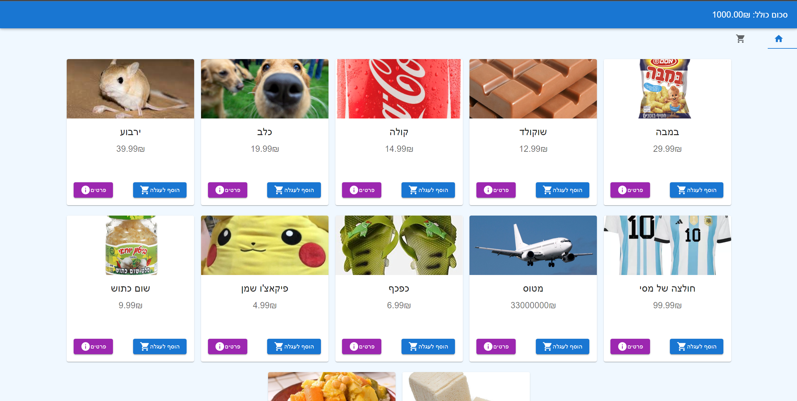
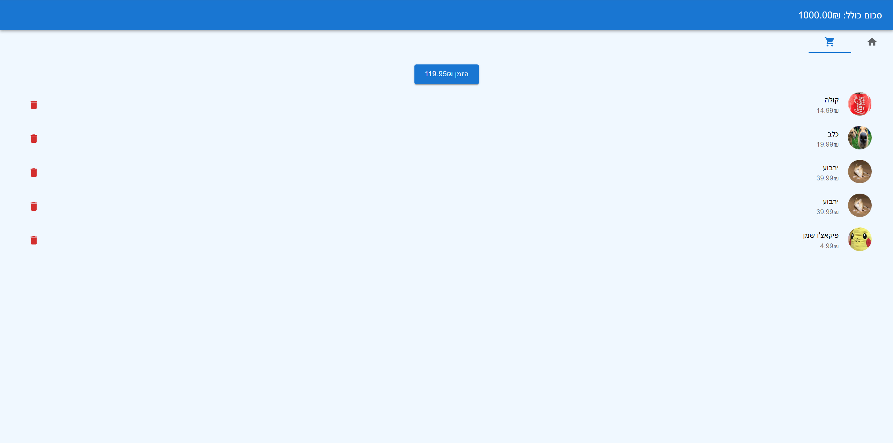

# ReactTraining
## This is an example project for new Globus developers
Once completed, you should have enough necessary knowledge of React and Redux to start working on our app.

## instructions:
You need to create a store page for ordering products. The product list and images will be given to you.
Your app should look and behave exactly like the one in this project, without looking/copying any of the code here.

## Final Product:

## What you need to learn before/during the work on this project: 
* Javascript and ES6
* Typescript
* React and MUI
* Redux

## Basic questions you need to be able to answer at the end of the project:
1. What is the significance of the "key" prop in React and when would you use it?
2. Explain the concept of state in React and how it differs from props.
3. How do you pass data from a parent component to a child component in React?
4. How do you pass data from a child component to a parent component in React?
5. What is the difference between mutable and immutable js objects? 
6. What is the best way to update a mutable state in React?

Good Luck!